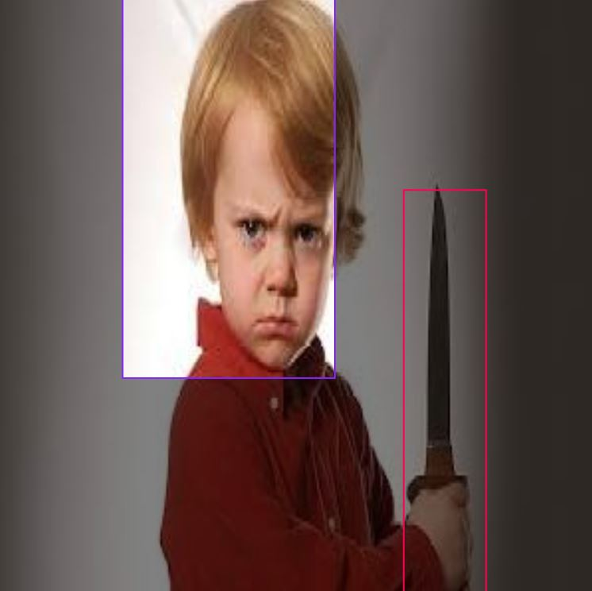
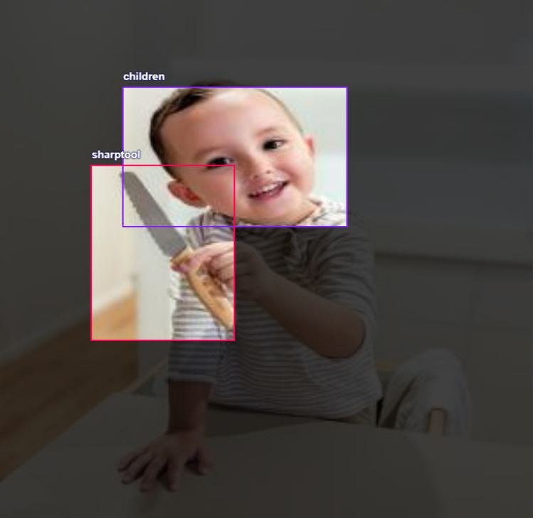
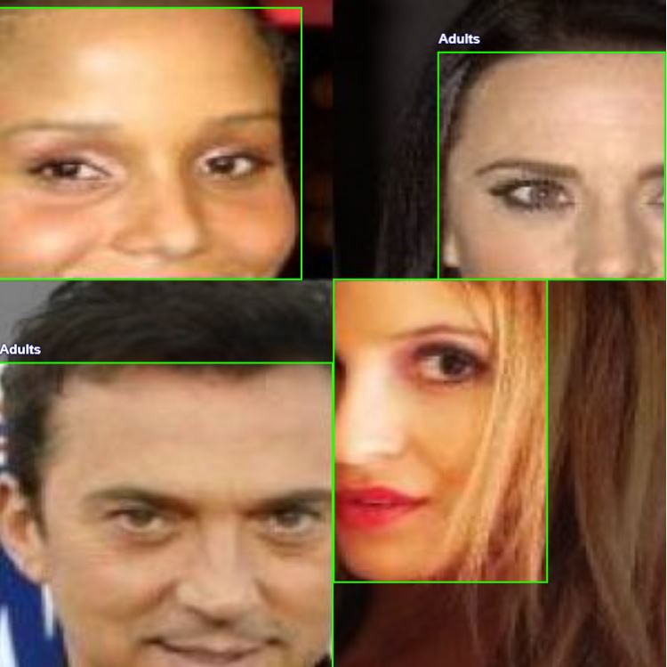
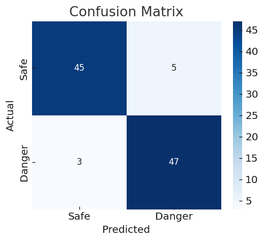
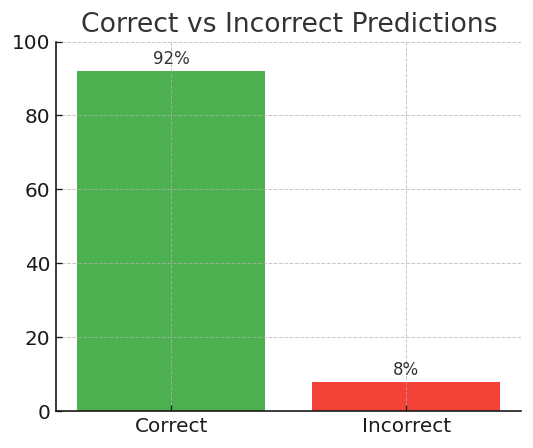
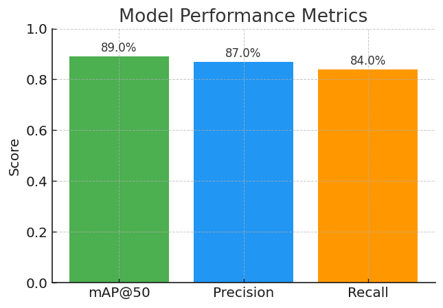

# 🛡️ Protect Your Children — AI + IoT Child Safety System

[](#)
[](#)
[](#)
[](#)
[](#)

> **Protect Your Children** is an AI + IoT prototype that detects children near dangerous zones (e.g., windows, balconies) or holding sharp objects.  
> It triggers **alerts/actuators** via Arduino to prevent accidents.

---

## 📑 Table of Contents
- [Overview](#-overview)
- [Features](#-features)
- [Results](#-results)
- [Project Structure](#-project-structure)
- [Python Code (AI)](#-python-code-ai)
- [Arduino Code (IoT)](#-arduino-code-iot)
- [GUI Code](#-gui-code)
- [Requirements](#-requirements)
- [Authors](#-authors)

---

## 🔎 Overview
This project combines **Computer Vision (YOLOv8)** with **IoT (Arduino)** to:
- Detect children near windows/balconies.
- Detect sharp objects (e.g., knife, scissors).
- Trigger Arduino **servo + buzzer** to close the window or raise an alarm.
- Provide an **easy-to-use GUI (Streamlit)** for image-based testing.

⚠️ **Note:** This is for educational and prototyping purposes only. It is not a certified safety device.

---

## ✨ Features
- Real-time detection with **YOLOv8**.  
- Web GUI built with **Streamlit** (upload images).  
- Bounding boxes drawn on the image.  
- Object list with confidence scores.  
- Arduino control for servo + buzzer.  

---

## ⚙️ How It Works
The AI model was trained on thousands of annotated images to distinguish between children and adults.
It can also recognize potentially dangerous objects such as knives or scissors.
When a child is detected near a risky zone (e.g., window, balcony) or holding a sharp object, the system sends a signal to the Arduino to trigger safety actions (alarm or servo).

- **Sharp Object Detection**  
  

- **Sharp Object Detection**  
  

- **adults**  
  

---

## 🎬 Results

- **Confusion Matrix**  
  

- **Correct vs Incorrect Predictions**  
  

- **Model Performance Metrics**  
  
  
---

## 📁 Project Structure
```
ProtectYourChildren/
│── arduino/child_safety.ino # Arduino firmware (servo + buzzer + ultrasonic)
│── ai/child_safety_ai.py # YOLOv8 real-time detection + serial comm
│── gui/app.py # Streamlit GUI (upload images)
│── model/yolov8n.pt # YOLO weights (not included; link externally)
│── results/sample.jpg
│── project_results/confusion_matrix.png
│── project_results/correct_vs_incorrect.png
│── project_results/metrics.png
│── requirements.txt
│── README.md
```

---

## 🐍 Python Code (AI)
```python
# ai/child_safety_ai.py
import cv2
import serial
from ultralytics import YOLO

# Load YOLOv8 model
model = YOLO("model/yolov8n.pt")

# Connect to Arduino (update COM port or /dev/ttyUSB0 for Linux)
arduino = serial.Serial(port="COM3", baudrate=9600, timeout=1)

# Start webcam
cap = cv2.VideoCapture(0)

while True:
    ret, frame = cap.read()
    if not ret:
        break

    results = model(frame)
    annotated = results[0].plot()

    # Check detections
    danger = False
    for box in results[0].boxes:
        cls = int(box.cls[0])
        label = model.names[cls]
        if label in ["person", "knife", "scissors"]:
            danger = True

    # Send signal to Arduino
    if danger:
        arduino.write(b'1')  # Close window / trigger buzzer
    else:
        arduino.write(b'0')

    cv2.imshow("Protect Your Children", annotated)
    if cv2.waitKey(1) & 0xFF == ord('q'):
        break

cap.release()
cv2.destroyAllWindows()

```
---

## 🛠 Arduino Code (IoT)
```C++
Arduino
#include <Servo.h>

#define TRIG 9
#define ECHO 10
#define BUZZER 7
#define SERVO_PIN 6

Servo windowServo;

void setup() {
  pinMode(TRIG, OUTPUT);
  pinMode(ECHO, INPUT);
  pinMode(BUZZER, OUTPUT);
  windowServo.attach(SERVO_PIN);
  windowServo.write(0);
  Serial.begin(9600);
}

void loop() {
  digitalWrite(TRIG, LOW);
  delayMicroseconds(2);
  digitalWrite(TRIG, HIGH);
  delayMicroseconds(10);
  digitalWrite(TRIG, LOW);

  long duration = pulseIn(ECHO, HIGH);
  int distance = duration * 0.034 / 2;

  Serial.print("Distance: ");
  Serial.println(distance);

  if (distance < 30) {
    digitalWrite(BUZZER, HIGH);
    windowServo.write(90);
    Serial.println("Warning: Child near window!");
    delay(1000);
  } else {
    digitalWrite(BUZZER, LOW);
    windowServo.write(0);
  }

  delay(200);
}
```
---

## GUI Code
```python

import streamlit as st
from PIL import Image
from ai.child_safety_ai import model

st.title("Protect Your Children — AI Safety System")

uploaded_file = st.file_uploader("Upload an image", type=["jpg","png"])
if uploaded_file:
    image = Image.open(uploaded_file)
    results = model(image)
    annotated_image = results[0].plot()
    st.image(annotated_image, caption="Detection Result", use_column_width=True)

```
## 📋 Requirements
```
opencv-python
ultralytics
streamlit
pyserial
Pillow
```
---
## Author
```
Ahmed Talaat
```

